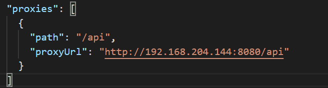
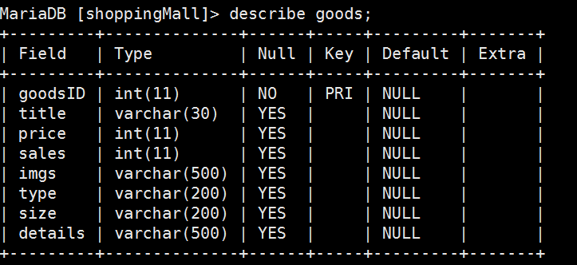
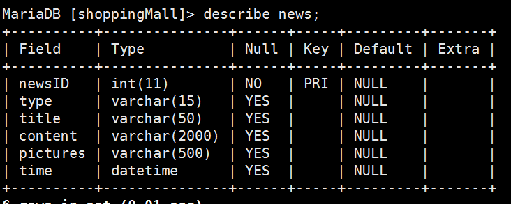
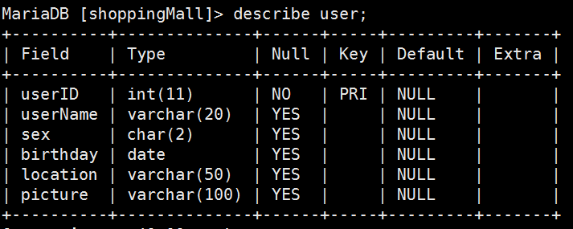
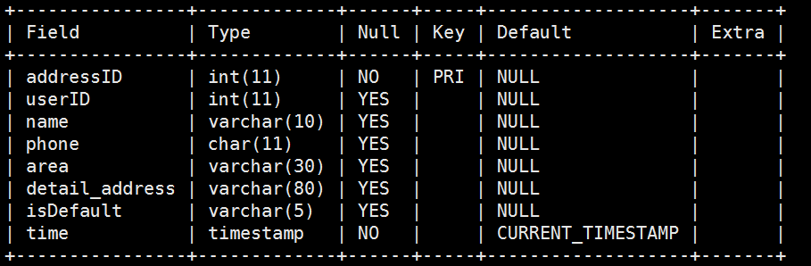

# zhangxinyu
电子购物商城前台子系统设计与实现

# 截至目前已完成任务
#### 墨刀原型设计
墨刀原型设计链接     [https://free.modao.cc/app/47f6e03dbb90c8b2f5dc9053163f6a7103ed0f87](https://free.modao.cc/app/47f6e03dbb90c8b2f5dc9053163f6a7103ed0f87)

#### ionic项目创建及配置相关文件
配置文件

#### 后端虚拟服务器环境配置及mysql数据库环境配置

#### 前后端数据交互
1. 前端发出http请求,服务器端做出相应,并将数据返回至浏览器端
2. 浏览器端做出数据解析,将数据呈现至前端页面上 

#### 服务器端代码编写
1. 编写api.js接口文件

#### 静态页面实现:
登录页  注册页  忘记密码页  首页  商品详情页  搜索页  商品详情页  咨询页  资讯详情页  我的页面  设置页  个人信息页  收货地址页 

#### 功能实现:
1. 登录页:登录功能
2. 注册页:注册功能
3. 首 页: 搜索功能 查看商品详情 
4. 地址页:查询收货地址 添加收货地址 编辑收货地址 删除收货地址 设置默认地址
5. 资讯页:请求资讯页面数据  查看资讯详情 

商品表

资讯表

用户表

登录表

地址表